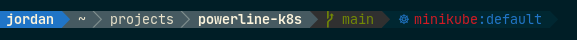

# powerline-k8s [](https://pypi.org/project/powerline-k8s/) 

A custom [Powerline](https://github.com/powerline/powerline) segment for displaying the current Kubernetes context and namespace.



## Installation

### Using pip

`$ pip install powerline-k8s`

## Local development

`$ pip install --editable .`

Installing the package in editable mode saves you from having to "re-install" to see the latest changes.

## Configuration

### Colorscheme

Add the following config items to your Powerline colorscheme config file (usually located at `~/.config/powerline/colorschemes/`),
see [Powerline Colorschemes](https://powerline.readthedocs.io/en/master/configuration/reference.html#colorschemes) for more info.

```json
{
  "k8s":           { "fg": "solarized:blue", "bg": "solarized:base02", "attrs": [] },
  "k8s_namespace": { "fg": "solarized:red",  "bg": "solarized:base02", "attrs": [] },
  "k8s_context":   { "fg": "solarized:blue", "bg": "solarized:base02", "attrs": [] },
  "k8s:divider":   { "fg": "gray4",          "bg": "solarized:base02", "attrs": [] }
}
```

### Segment

Add the following config item to your Powerline segments config file (usually located at `~/.config/powerline/themes/shell/`),
see [Powerline Segment reference](https://powerline.readthedocs.io/en/master/configuration/segments.html#segment-reference) for more info.

```json
{
  "function": "powerline_k8s.k8s",
  "priority": 30
}
```

### Toggle visibility

Toggle entire segment or specific section's visibility with the following environment variables:

- `POWERLINE_K8S_SHOW`
- `POWERLINE_K8S_SHOW_NS`

```shell
# toggle segment visibility
$ POWERLINE_K8S_SHOW=0 powerline-daemon --replace # hide powerline-k8s segment
$ POWERLINE_K8S_SHOW=1 powerline-daemon --replace # show powerline-k8s segment (default)

# toggle namespace section visibility
$ POWERLINE_K8S_SHOW_NS=0 powerline-daemon --replace # hide namespace section
$ POWERLINE_K8S_SHOW_NS=1 powerline-daemon --replace # show namespace section (default)
```
